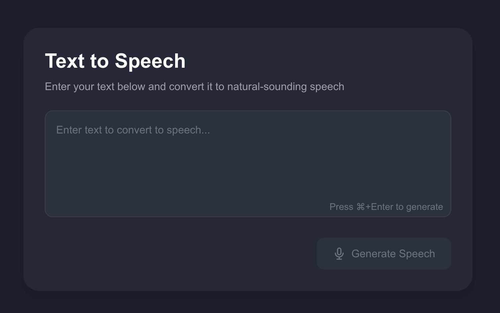

# AI SDK Voice Demo

A modern, responsive web application that converts text to natural-sounding speech using OpenAI's Text-to-Speech API. Built with Next.js 14, TypeScript, and Tailwind CSS.



## Features

- 🎯 Text to Speech conversion using OpenAI's TTS API
- 🎨 Modern, dark-themed UI with responsive design
- ⌨️ Keyboard shortcuts (⌘+Enter / Ctrl+Enter) for quick generation
- 🌓 Sophisticated error handling and loading states
- 🚀 Fast and efficient audio streaming
- 📱 Mobile-friendly interface

## Tech Stack

- **Framework**: Next.js 14 with App Router
- **Language**: TypeScript
- **Styling**: Tailwind CSS
- **API Integration**: Vercel AI SDK
- **Text-to-Speech**: OpenAI TTS-1-HD Model

## Getting Started

### Prerequisites

- Node.js 18.17 or later
- pnpm 8.0 or later
- OpenAI API key

### Installation

1. Clone the repository:

   ```bash
   git clone https://github.com/rezashahnazar/ai-text-to-speech.git
   cd ai-text-to-speech
   ```

2. Install dependencies:

   ```bash
   pnpm install
   ```

3. Create a `.env.local` file in the root directory:

   ```env
   OPENAI_API_KEY=your_api_key_here
   OPENAI_BASE_URL=your_base_url_here
   ```

4. Run the development server:

   ```bash
   pnpm dev
   ```

5. Open [http://localhost:3000](http://localhost:3000) in your browser.

## Usage

1. Enter your text in the textarea
2. Generate speech by either:
   - Clicking the "Generate Speech" button
   - Using ⌘+Enter (Mac) or Ctrl+Enter (Windows/Linux)
3. The generated audio will play automatically

## API Endpoints

### POST /api/speech

Converts text to speech using OpenAI's TTS API.

**Request Body:**

```json
{
  "text": "Text to convert to speech"
}
```

**Response:**

- `200 OK`: Returns audio data (audio/mpeg)
- `500 Error`: Returns error message
- `504 Timeout`: Returns timeout error message

## Environment Variables

- `OPENAI_API_KEY`: Your OpenAI API key
- `OPENAI_BASE_URL`: Your OpenAI API base URL

## Development

### Project Structure

```
aisdk-voice/
├── src/
│   ├── app/
│   │   ├── api/
│   │   │   └── speech/
│   │   │       └── route.ts
│   │   ├── layout.tsx
│   │   └── page.tsx
│   └── components/
│       └── SpeechButton.tsx
├── public/
├── .env
└── package.json
```

### Scripts

- `pnpm dev`: Start development server
- `pnpm build`: Build for production
- `pnpm start`: Start production server
- `pnpm lint`: Run ESLint

## Contributing

1. Fork the repository
2. Create your feature branch (`git checkout -b feature/amazing-feature`)
3. Commit your changes (`git commit -m 'Add some amazing feature'`)
4. Push to the branch (`git push origin feature/amazing-feature`)
5. Open a Pull Request

## License

This project is licensed under the MIT License - see the [LICENSE](LICENSE) file for details.

## Acknowledgments

- [Vercel AI SDK](https://sdk.vercel.ai/docs)
- [OpenAI TTS API](https://platform.openai.com/docs/guides/text-to-speech)
- [Next.js](https://nextjs.org/)
- [Tailwind CSS](https://tailwindcss.com/)
